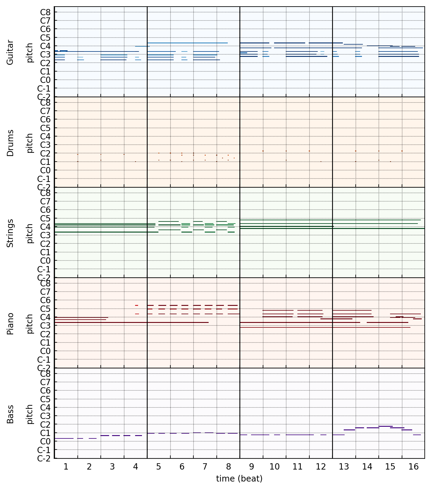
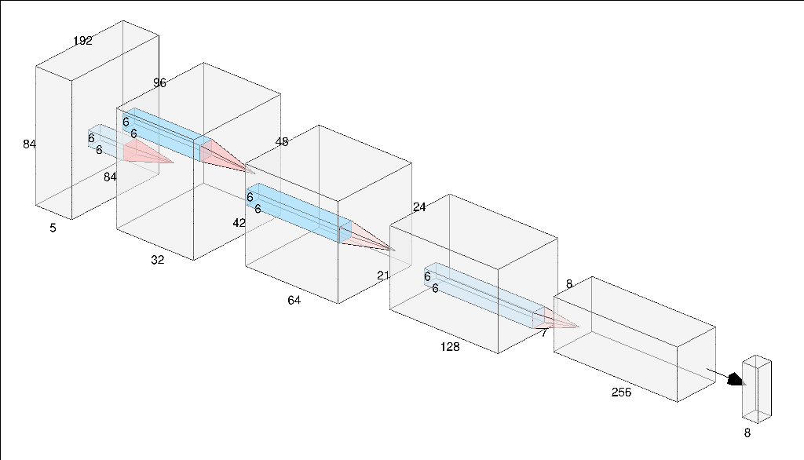

Music generation with Wasserstein Autoencoders
===

This is my final project for the Machine Learning class at the University of Florence. I investigated the use of Wasserstein Autoencoders (WAEs)[^1] in the field of music generation. 

I've written a [blog post](https://w00zie.github.io/post/wae) where you can find a few more insights on the theory and where you can listen to the results!

## Repository structure

The repository is structured as following:
- `configs/` : contains the config files (Python plain dictionaries) with the hyperparameters settings.
- `data/` : contains the dataset (a little portion).
- `img/` : just used to display the pictures in the README.
- `models/` : code for the neural networks (plus a small "utils" library I've used to test the models functionalities).
- `runs/` : Tensorboard (and hyperparameters) logs of a few experiments I've run.
- `utils/` : small library of functions used in this project (data/model loading, midi conversion, I/O...)
- `inference.py` : a script used to save the output tensors from the generator (in `.npy` format).
- `train_wae_gan.py`: a script that runs a training of a WAE-GAN model (using the hparams in `configs/`).
- `train_wae_mmd.py`: a script that runs a training of a WAE-MMD model (using the hparams in `configs/`).

## The data

The data I used is in the [pianoroll](https://en.wikipedia.org/wiki/Piano_roll) format, coming from a dataset published by a group of researchers of the [Academia Sinica](https://musicai.citi.sinica.edu.tw/) (Taiwan), as part of a paper[^2] where they jointly proposed a novel GAN (MuseGAN) and released the dataset where the model was trained on. You can check it out [here](https://salu133445.github.io/musegan/data).

Technically speaking every element of this dataset is a binary-valued (note on/off - no velocity information) tensor of shape (192, 84, 5) where 
1. 192 is the number of time steps used to quantize a measure of 4 bars (in 4/4).
2. 84 is the pitch extension (ranging from C1 to B7).
3. 5 is the number of instruments involved in the piece: *drums*, *guitar*, *piano*, *bass* and *strings*.

This is what an element of the dataset looks like

<p align="center">
    
</p>

This data format suggested the use of CNNs, where the instruments play naturally the role of the colors for the images.

## The model

WAEs are a family of generative models. They employ a regularizer derived by the theory of optimal transport that is used to match the aggregated distribution (coming from the real data) to a prior distribution. This framework has been developed to tackle the problem of the *blurriness* of the samples generated by other AEs.

The authors propose two algorithms for training a WAE:

1. **WAE-GAN**: which employs a *Discriminator* <ins>in the latent space</ins> that learns to separate samples coming from the prior distribution to the ones coming from the real distribution.
2. **WAE-MMD**: which employs the Maximum Mean Discrepancy as the distance between the two distributions in the latent space. This approach has the benefit of resulting in a min / min optimization problem, avoiding the problems that can be risen by the adversarial framework.

### Architectures

Both the encoder and decoder are CNNs, inspired by the DCGAN model. I've coded a few of them (they are all almost identical) that you can inspect in the `./models` subdirectory. The discriminator is a "vanilla" NN with 6 Dense layers and ReLUs activations. This is an example of an encoder (the decoder is symmetrical)

<p align="center">
    
</p>

## Running a new experiment

Let's say you want to train a new WAE-GAN model (the procedure is equivalent for WAE-MMD). You have to set your hyperparameters in `configs/wae_gan_config.py` and run `python train_wae_gan.py`.

This will create a new directory under `runs/` where your experiment will be logged (Tensorboard and hyperparameters).

## Generating samples from a trained model

The script `inference.py` will generate new samples (in the form of `.npy` arrays) from the model you want to test. You have to specify the experiment directory and the number of samples you want to generate. Let's say that you want to test the experiment `runs/exp_000` and you want to generate 32 new samples, you have to run
```
python inference.py --exp_dir runs/exp_000 --num_samples 32    
```
and the script will create a new subdir `runs/exp_000/samples` where the generated tensors will be stored.

## Listening to the generated samples

The procedure described above generates samples in the form of `(num_timesteps, num_pitches, num_instr)` numpy arrays. In order to be able to listen them you have to convert them to MIDI files (`.mid`). This is done through the `utils/listen.py` script. You just have to run
```
python utils/listen.py --exp_dir runs/exp_000
```
The script will check for the presence of samples (`.npy` arrays) and will create a directory under `runs/exp_000/samples/` that containes the decoded `.mid` files. The decoding is demanded to the [pypianoroll](https://github.com/salu133445/pypianoroll) library.

At the moment I do not provide the possibility of exporting these MIDI files to, say, MP3. I've done the conversions inside VLC with the use of its embedded synthesizer (FluidSynth).

## Requirements
```
tensorflow>=2.2.0
pypianoroll
```

References
===

[^1]: [Wasserstein Auto-Encoders](https://arxiv.org/abs/1711.01558)

[^2]: [MuseGAN: Multi-track Sequential Generative Adversarial Networks for Symbolic Music Generation and Accompaniment](https://arxiv.org/abs/1709.06298)